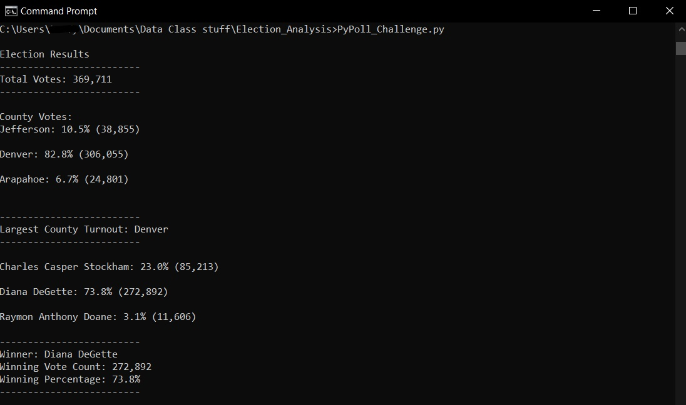
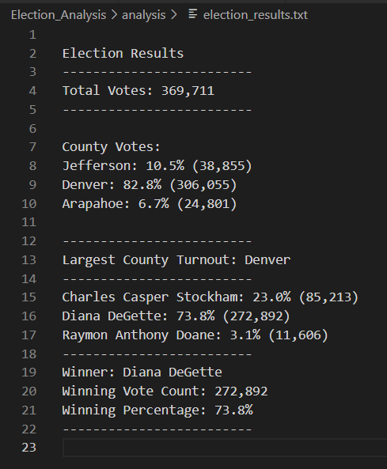
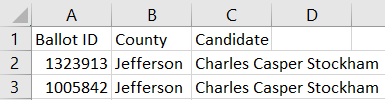
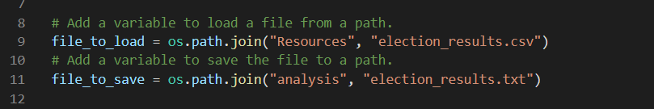
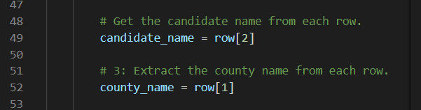

# Election Analysis

## Overview Election Audit
A Colorado Board of Elections employee has given the following tasks to complete the election audit of a recent local congressional election:

1. Calculate the total number of votes cast.
2. Provide the number of votes and percentage of total votes for each county in the precinct.
3. Find the county with the largest voter turnout.
4. Get a complete list of candidates who received votes.
5. Calculate the total number of votes each candidate received.
6. Calculate the percentage of votes each candidate won.
7. Determine the winner of the election based on popular vote.

## Election Audit Results
Results from the script for the [PyPoll Challenge](PyPoll_Challenge.py) as shown in the Command Prompt and as [Election Results](analysis/election_results.txt) copied to a text file, respectively:

 

The analysis of the election shows that:
- There were 369,711 votes cast in the election.
- The counties involved in the election were:
  - Jefferson
  - Denver
  - Arapahoe
- The voting results of each county were:
  - Jefferson county reported at 10.5% of the total votes with 38,855 votes.
  - Denver county reported at 82.8% of the total votes with 306,055 votes.
  - Arapahoe county reported at 6.7% of the total votes with 24,801 votes.
- The county with the largest voter turnout was Denver with 82.8% of the total votes at 306,055 votes.
- The candidates were:
  - Charles Casper Stockham
  - Diana DeGette
  - Raymon Anthony Doane
- The candidate results were:
  - Charles Casper Stockham, who received 23.0% of the vote with 85,213 votes.
  - Diana DeGette, who received 73.8% of the vote with 272,892 votes.
  - Raymon Anthony Doane, who received 3.1% of the vote with 11,606 votes.
- The winner of the election was:
  - Diana DeGette, who received 73.8% of the vote with 272,892 votes.

## Election Audit Summary
Provided the proper documents, the script, [PyPoll Challenge](PyPoll_Challenge.py), used to procure these results can be re-worked slightly to accommodate getting the results of other elections. By simply changing the file the code works from--in this case it was the [Election Results CSV](Resources/election_results.csv) file, as in the photo below--we can use this [script](PyPoll_Challenge.py) for other elections. Making sure the columns listed in the file are the same as those in the [Election Results CSV](Resources/election_results.csv) file (e.g., Ballot ID, County, Candidate) and in the same order, as shown here:

You may not have to adjust anything but the folder location and file name--as listed in the code shown below with "Resources", "election_results.csv" and "analysis", "election_results.txt":

If the column order is different, it's a simple change of a few lines of code; like changing the index number in the "candidate_name = row[2]" and "county_name = row[1]" variables, as shown here:

to align with whichever column in the CSV file matches the variable needed in order for the code to work on a new set of data. For example, if the two listed above's columns were swapped, the code would then read, "candidate_name = row[1]" and "county_name = row[2]".

## Resources
- Data Source: [Election Results CSV](Resources/election_results.csv)
- Software: [Python](https://www.python.org/), 3.7.6, [Visual Studio Code](https://code.visualstudio.com/), 1.65.2
